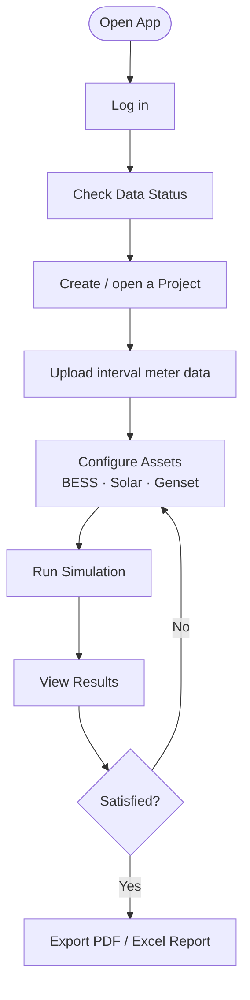

# User Guide — WEM Energy Cost Modelling Tool

This guide is for analysts and energy consultants who use the WEM Energy Cost Model web application to model and optimise energy costs in the Western Australian Wholesale Electricity Market (SWIS/WEM).

---

## Application Workflow

---

## 1. Logging In

Navigate to the app URL (e.g. <https://auzvolt-wem-energy-cost-model.streamlit.app>).

You will be presented with the login screen. Enter your **username** and **password** (provided by your administrator). Two roles exist:

| Role | Access |
|------|--------|
| `analyst` | Data Status, Project Designer, Results, Reports |
| `admin` | All analyst pages plus the Assumptions library |

After a successful login you will see the main dashboard with the sidebar navigation.

---

## 2. Data Status Page (📥 Data Status)

The **Data Status** page shows the health of the AEMO WA data pipeline:

- **Last successful ingest** — timestamp of the most recent completed data pull
- **Data freshness** — how many hours ago each dataset was last updated
- **Error log** — any pipeline errors from the last 24 hours

If data is stale, contact your administrator to check the pipeline scheduler.

---

## 3. Project Designer (📋 Project Designer)

### Create a project

1. In the **Project Designer** page, click **New Project**.
2. Enter a project name and select the **site location** (Perth Metro, Pilbara, South-West WA, etc.).
3. Select the **tariff** that applies to your site (RT2, RT5, RT7 — see [docs/western-power-tariffs.md](western-power-tariffs.md) for rate details).
4. Set the **analysis period** (financial year or rolling 12 months).

### Upload interval meter data

The app accepts **NEM12** (AEMO standard interval meter format) and plain **CSV** files.

1. Navigate to **Project Designer → Interval Data**.
2. Click **Upload meter data** and select your `.csv` or `.nem12` file.
3. The app will detect the interval length (5 min, 15 min, 30 min) and normalise to 30-minute intervals.
4. Review the load profile chart. If the data looks incorrect, re-upload with the correct file.

**CSV format** (if not using NEM12):

| Column | Format | Example |
|--------|--------|---------|
| `timestamp` | ISO 8601 or `DD/MM/YYYY HH:MM` | `2024-07-01 00:30` |
| `energy_kwh` | Float, consumption in kWh | `42.5` |

---

## 4. Configuring Assets

### Battery Energy Storage System (BESS)

In the **Project Designer → Assets** tab:

1. Click **Add asset → Battery (BESS)**.
2. Set the key parameters:

| Parameter | Description | Typical range |
|-----------|-------------|---------------|
| **Capacity (kWh)** | Usable storage capacity | 100 – 10,000 kWh |
| **Power rating (kW)** | Maximum charge / discharge rate | 50 – 5,000 kW |
| **Round-trip efficiency (%)** | AC-AC efficiency | 85 – 95% |
| **Initial SoC (%)** | State of charge at period start | 50% |
| **Min / Max SoC (%)** | Operating limits | 10% / 90% |
| **Degradation curve** | LFP or NMC chemistry | — |

3. Optionally enable **FCESS participation** to allow the BESS to bid into the Frequency Contingency Reserve market.

### Solar PV

1. Click **Add asset → Solar PV**.
2. Set the installed capacity (kWp) and the system location (used to select the correct yield profile from the assumption library).
3. You can override the monthly capacity factors if you have a site-specific production estimate.

### Diesel/Gas Genset

1. Click **Add asset → Genset**.
2. Set the rated capacity (kW), fuel type, heat rate (MJ/kWh), and fuel cost ($/GJ).
3. Set the minimum loading (% of rated capacity) — the model will enforce this as a minimum output when the unit is committed.

### Load Flexibility (Demand Response)

1. Click **Add asset → Load Flexibility**.
2. Define the shiftable load profile (kWh), the allowable shift window (hours), and any minimum/maximum daily shift limits.

---

## 5. Running a Simulation

1. Once all assets are configured, click **Run Simulation** at the bottom of the Project Designer.
2. The optimisation engine (Pyomo LP/MILP) will solve for the least-cost dispatch schedule over the selected period.
3. A progress indicator is shown while the solver runs (typically 5–60 seconds depending on period length and asset count).
4. On completion, you are automatically redirected to the **Results** page.

---

## 6. Viewing Results (📈 Results)

The Results page shows:

- **Cost summary** — total energy cost, network charges, and market costs
- **Dispatch profile chart** — 30-minute dispatch schedule for each asset over the analysis period
- **BESS SoC chart** — battery state of charge over time
- **Scenario comparison** — if multiple scenarios have been run, a side-by-side cost comparison table
- **Financial metrics** — NPV, IRR, payback period for the asset investment

Use the **date range slider** to zoom into specific periods (e.g. peak demand weeks).

---

## 7. Exporting Reports (📊 Reports)

From the **Reports** page:

1. Click **Generate PDF Report** to produce a formatted PDF with:
   - Executive summary
   - Cost breakdown table
   - Dispatch profile charts
   - Financial metrics table
2. Click **Generate Excel Workbook** for a multi-sheet workbook containing:
   - Summary sheet
   - 30-minute interval dispatch data
   - Monthly cost breakdown
   - Asset parameters

Reports are downloaded directly to your browser's download folder.

---

## 8. Managing Assumptions (⚙️ Assumptions — Admin Only)

> This page is only visible to users with the `admin` role.

The **Assumptions** page manages the underlying data used by the optimisation engine: tariff rates, BESS degradation curves, solar yield profiles, and capex/opex reference values.

### Import an assumption set

1. Click **Choose a file** and upload a `.json` or `.xlsx` assumption file.
2. If the file is valid, a success message shows the set name and entry count.
3. The imported set becomes the active assumption set for the current session.

### Export the current assumption set

With an assumption set loaded:

- Click **Download as JSON** for a machine-readable export.
- Click **Download as Excel** for a spreadsheet export suitable for review and editing.

To restore the WA defaults, ask your administrator to re-run the seeder (`python -m db.seed`).

---

## Getting Help

- **Developer documentation:** [docs/developer-guide.md](developer-guide.md)
- **AEMO API reference:** [docs/aemo_wa_api_mapping.md](aemo_wa_api_mapping.md)
- **Tariff schedule reference:** [docs/western-power-tariffs.md](western-power-tariffs.md)
- **Deployment guide:** [docs/deployment.md](deployment.md)
